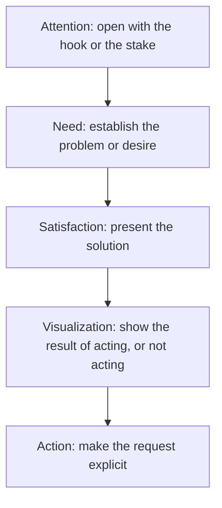

# Persuasive Mode

> **Purpose:** to influence the reader's beliefs, attitudes, decisions, or actions.

Persuasion may include logical argument, but it also considers credibility, emotion, values, timing, and the cost of action. It is the "why should I care, and what should I do?" mode.

## When to Use It

- Drive a decision or action (proposal, recommendation, call to action)
- Change a belief or attitude (opinion article, campaign message)
- Sell an idea, product, or course of action (copy, cover letter)

## The Three Appeals

Classical rhetoric identifies three persuasive levers:

| Appeal | What it draws on | Example |
|---|---|---|
| **Logos** | Reasoning, evidence, consistency | "The data show a 20% retention gain." |
| **Ethos** | Credibility, expertise, fairness | "As a ten-year practitioner..." |
| **Pathos** | Emotion, identity, values | "Imagine opening an app that finally respects your time." |

The three almost always work together. A strong appeal rarely depends on one alone; a weak one leans on a single lever to the exclusion of the others.

## Argumentation vs. Persuasion

The two are related but not identical:

| Argumentation | Persuasion |
|---|---|
| Seeks rational acceptance of a claim | Seeks a change in belief, attitude, or action |
| Emphasizes evidence and reasoning | Uses reasoning, credibility, emotion, and framing |
| May conclude without a call to action | Often includes a specific call to action |
| Evaluated mainly by logical strength | Also evaluated by audience response and ethics |

## Structure



## Key Techniques

### Make the Request Explicit

Persuasion that never asks is merely commentary. State the desired action, owner, and deadline.

### Frame for the Audience's Values

The same fact persuades differently depending on how it is framed. Lead with the value the audience already holds.

### Earn Ethos, Don't Claim It

Credibility comes from demonstrated expertise and fairness, not from declaring "I am an expert."

### Weigh the Cost of Action

Persuasion often fails because the action is costly. Acknowledge the cost and show it is worth bearing.

## Ethical Persuasion

Ethical persuasion should:

- Represent evidence accurately
- Avoid hiding material risks
- Distinguish facts from assumptions
- Avoid exploiting fear or prejudice
- Present alternatives fairly
- Make the requested action explicit

## Example

> Approve the six-month hybrid-work trial to reduce office costs, improve employee retention, and collect evidence before introducing a permanent policy.

## Common Pitfalls

- **Pathos without logos:** emotional appeal with no substance behind it
- **No call to action:** persuasion that never asks the reader to do anything
- **Manipulation:** hiding risks or exploiting fear to force a decision
- **One-lever appeals:** ignoring two of the three appeals entirely

## Quality Criterion

> Persuasion should influence readers without misleading or manipulating them.

## Related

- [[Argumentative-Mode]]: the reasoning core beneath persuasion
- [[Narrative-Mode]]: stories persuade through stakes and empathy
- [[07-Persuasive-Writing-Guide]]: argumentative essays, AIDA copywriting, proposals
- [[00-Writing-Types-Reference]]: the multidimensional model
- [[tier-1-modes/overview|Tier 1 overview]]

## Template

> Copy this skeleton into a new note; name live files `YYYYMMDD-<slug>.md`. Full fill-in masters (AIDA copywriting, Proposal/Pitch, Quick Check): [[persuasive]].

```markdown
---
date: YYYY-MM-DD
tags: [writing, persuasive]
---

# <Subject / campaign>

**Goal:** <the ONE belief or action to change>
**Audience & their values:** <frame around what they already hold>

## Logos (reason / evidence)
- <facts, data, consistency>

## Ethos (credibility / fairness)
- <demonstrated expertise, not claimed>

## Pathos (emotion / values / consequences)
- <identity, stakes, human cost>

## The ask
<ONE explicit action, with owner and deadline — never two>
```

## Sources

- Wikipedia, "Modes of persuasion" (https://en.wikipedia.org/wiki/Modes_of_persuasion)
- Fiveable, "Rhetorical Appeals (Ethos, Pathos, Logos)" (https://fiveable.me/english-11/unit-6/rhetorical-appeals-ethos-pathos-logos/study-guide/14FiHIUJ9cUR7aZb)
