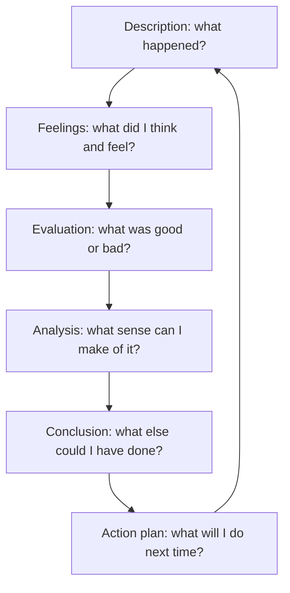
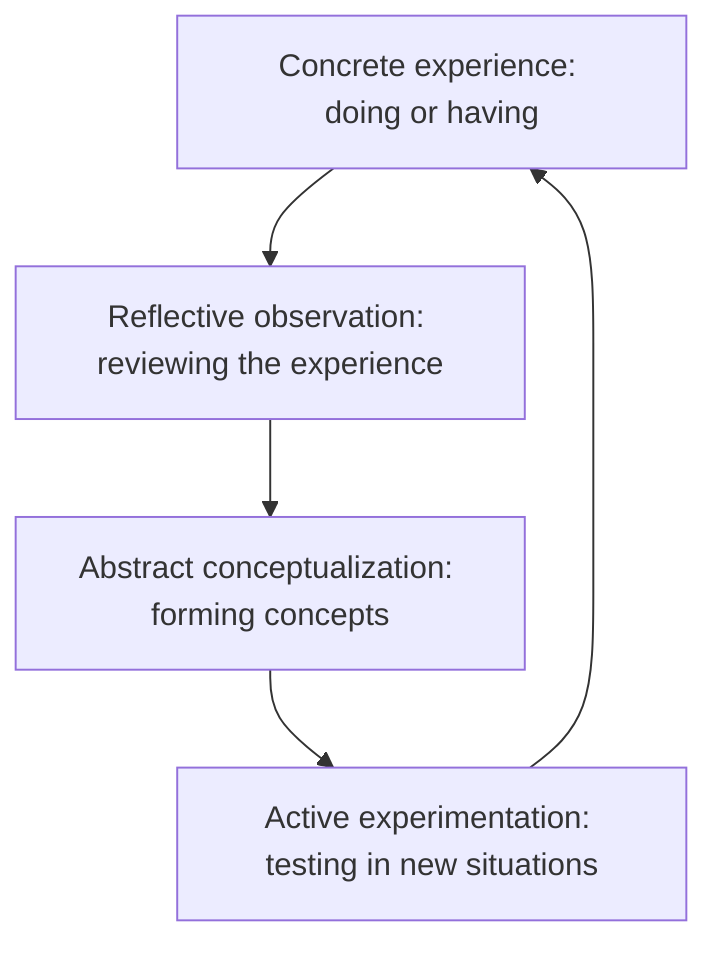

# Reflective Mode

> **Purpose:** to examine an experience, decision, or learning process and derive meaning from it.

Reflection is more than personal description. It connects experience with interpretation, concepts, and future action. It is the "what did I learn, and what will I do differently?" mode.

## When to Use It

- Review a project, decision, or period of work
- Capture learning that will inform future action
- Record professional growth for a portfolio or review

## Core Models

Two established frameworks structure reflection:

### Gibbs' Reflective Cycle



### Kolb's Experiential Learning Cycle



A functional six-part sequence maps onto these:

1. **Experience:** What happened?
2. **Response:** What did I think, feel, or assume?
3. **Analysis:** Why did it happen, and what concepts explain it?
4. **Evaluation:** What worked, failed, or remained uncertain?
5. **Learning:** What did I discover?
6. **Action:** What will I do differently next time?

## Key Techniques

### Move Beyond Description

Description is the raw material, not the product. The value of reflection lies in the interpretation and the resulting action.

### Connect to Concepts

Strong reflection names the concepts that explain the experience, turning a private story into transferable understanding.

### End in Action

A reflection that produces no changed behavior is incomplete. The closing move is a concrete plan for next time.

## Example

> I initially interpreted fewer meetings as weaker collaboration. After reviewing the project outcomes, I realized that written decision records had made responsibilities clearer.

## Common Pitfalls

- **Diary, not reflection:** describing without interpreting or learning
- **No concept link:** the experience stays private and untransferable
- **No action:** insight that never becomes a plan
- **Polished self-justification:** using reflection to confirm, not question

## Quality Criterion

> Reflection should transform experience into transferable learning.

## Related

- [[Narrative-Mode]]: reflection is narrative turned inward
- [[Analytical-Mode]]: the analysis stage of reflection
- [[01-Review-Writing-Guide]]: post-hoc evaluation
- [[00-Writing-Types-Reference]]: the multidimensional model
- [[writing/00_knowledge/advance/tier-1-modes/00_overview|Tier 1 overview]]

## Template

> Copy this skeleton into a new note; name live files `YYYYMMDD-<slug>.md`. No dedicated form template exists yet — this is it. The six stages map to Gibbs' cycle above.

```markdown
---
date: YYYY-MM-DD
tags: [writing, reflective]
---

# <Experience / decision being reflected on>

## Description — what happened?
## Feelings — what did I think and feel?
## Evaluation — what was good or bad about it?
## Analysis — what sense can I make of it (which concepts explain it)?
## Conclusion — what else could I have done?
## Action plan — what will I do differently next time?
```

## Sources

- University of Edinburgh, "Gibbs' Reflective Cycle" (https://reflection.ed.ac.uk/reflectors-toolkit/reflecting-on-experience/gibbs-reflective-cycle)
- SimplyPsychology, "Kolb's Experiential Learning Cycle" (https://www.simplypsychology.org/learning-kolb.html)
