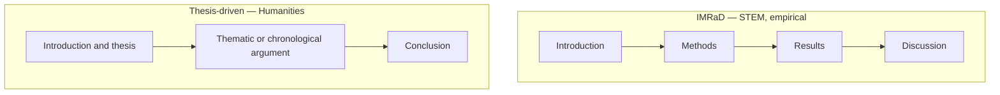

# Academic Writing

> **Purpose:** to develop, test, communicate, or evaluate knowledge.

Academic writing participates in a scholarly conversation. It is not defined by complex vocabulary but by methodological transparency, evidence, traceability, and engagement with prior work.

## When to Use It

- Develop or defend a thesis or research question
- Report original findings to a scholarly audience
- Review and synthesize existing literature
- Establish credentials within a discipline

## Core Characteristics

- A precise research question or thesis
- Engagement with existing scholarship
- Evidence-based reasoning
- Explicit research methods when applicable
- Accurate citation and attribution
- Recognition of limitations
- Formal and disciplined language

## Structure

Two dominant conventions shape the body of academic work:



| Section | IMRaD (STEM) | Thesis-driven (Humanities) |
|---|---|---|
| Open | Introduction: question + significance | Introduction: thesis statement |
| Middle | Methods → Results → Discussion | Body organized by theme or chronology |
| Close | Conclusion + limitations | Conclusion: what the argument established |

The **thesis statement** is the load-bearing element of the humanities form: one arguable sentence that the whole piece supports.

## Key Conventions

### Cite to Trace, Not to Decorate

Every factual or borrowed claim carries an attribution so the reader can follow it to its source. Citation is a navigation tool, not a formality.

### State Limitations Honestly

A strong academic piece names what it does *not* show. Scope and limits are marks of rigor, not weakness.

### Separate Method from Finding

The reader must be able to distinguish *how* you arrived at a claim from *what* you found. Methodological transparency is what makes findings trustworthy.

### Tense and Style Discipline

Within IMRaD, tense follows convention (past for what you did, present for established knowledge). Consult your field's style manual (APA, MLA, Chicago).

## Example

> Across both survey waves, reported reading time declined while screen time rose. However, because the sample was self-selected and single-institution, the effect cannot yet be generalized beyond this population.

## Common Pitfalls

- **Complex vocabulary as a substitute for rigor:** density mistaken for depth
- **Missing or thin limitations:** overclaiming the scope of the finding
- **Unattributed claims:** borrowed ideas without citation
- **Method opaque:** findings presented with no account of how they were reached

## Quality Criterion

> Methodological transparency, evidence, traceability, and participation in scholarly discussion — not vocabulary alone.

## Template

> Copy this skeleton into a new note; name live files `YYYYMMDD-<slug>.md`. Full fill-in master for the academic/whitepaper section: [[expository]].

```markdown
---
date: YYYY-MM-DD
tags: [writing, academic]
---

# <Working title>

**Thesis / research question:** <the ONE claim this piece supports or tests>
**Field & style manual:** <discipline — APA / MLA / Chicago>
**Structure:** IMRaD | thesis-driven

## Context / prior work
<what is already known, cited>

## Method
<how you investigated or built the case>

## Findings / argument
<what you found — precision over style>

## Limitations
<what this does NOT show — state scope honestly>

## Sources
<full citations for every borrowed claim>
```

## Related

- [[Expository-Mode]]: the primary mode of academic explanation
- [[Argumentative-Mode]]: the thesis-driven form is argumentation
- [[06-Expository-Writing-Guide]]: academic writing as a pattern
- [[00-Writing-Types-Reference]]: the multidimensional model
- [[writing/00_knowledge/advance/tier-2-domains/00_overview|Tier 2 overview]]

## Sources

- CASRAI, "Humanities Article Structure vs. IMRaD" (https://casrai.org/guides/humanities-article-structure-vs-imrad)
- Researcher.Life, "What is IMRaD Format in Research?" (https://researcher.life/blog/article/what-is-imrad-format-in-research/)
