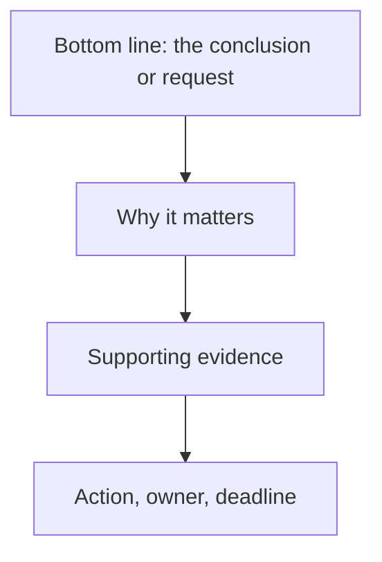

# Business Writing

> **Purpose:** to support organizational communication, coordination, decisions, and accountability.

Business writing is writing that gets something done. Its readers are busy and decision-oriented, so the main point comes early and the ask is explicit.

## When to Use It

- Request a decision, approval, or resource
- Coordinate a team or project
- Record a decision, plan, or responsibility
- Report status or findings to stakeholders

## Core Characteristics

- The main point appears early
- Responsibilities and requested actions are explicit
- Information is concise and operationally relevant
- Risks, costs, deadlines, and dependencies are visible
- Tone reflects the organizational relationship
- Decisions can be traced to evidence and ownership

## The Core Pattern: BLUF

**Bottom Line Up Front** — lead with the conclusion, then support it:



A memo, email, or executive summary that opens with the ask respects the reader's time; one that buries it invites a skim and a miss.

## Length by Stakes

| Decision weight | Format | Length |
|---|---|---|
| Routine | One-page brief | A few paragraphs |
| Important | Six-pager / memo | A few pages |
| Strategic | Paper / strategy document | 15–30 pages, with a ruthless executive summary |

## Key Conventions

### Make the Ask Concrete

State exactly what you want — budget, decision, action — and who owns it and by when. An implied ask is an unanswered message.

### Surface Risk and Cost

Business readers weight downside heavily. Name risks, costs, and dependencies rather than burying them.

### One Message per Communication

A memo that asks for three things gets one answered. If the requests are independent, split them.

### Match Tone to Relationship

The register is set by the relationship: direct to a peer, more formal to a superior or external party.

## Example

> Please approve the Q4 infrastructure budget by Friday. Delaying beyond Friday risks missing the vendor's end-of-month pricing window, which would add roughly 15% to the cost. The breakdown is attached; the largest line is the database migration.

## Common Pitfalls

- **Buried ask:** the request appears on page three, or never
- **No owner or deadline:** an action with no one accountable to it
- **Hidden risk:** downside omitted to make the case look cleaner
- **Multiple asks in one message:** the reader answers one and drops the rest

## Quality Criterion

> The reader can act — decide, approve, or execute — after one read, with the ask, owner, and deadline unambiguous.

## Template

> Copy this skeleton into a new note; name live files `YYYYMMDD-<slug>.md`. Full fill-in master for the proposal/pitch form: [[persuasive]].

```markdown
---
date: YYYY-MM-DD
tags: [writing, business]
---

# <Subject> — <Decision or action needed>

**BLUF:** <the conclusion or request in one sentence>

## Why it matters
<stakes for the reader / organization>

## Supporting evidence
- <fact, cost, or data that justifies the ask>

## Risks and dependencies
- <downside and what it depends on>

## The ask
<exactly what is needed — budget, decision, action — with owner and deadline>
```

## Related

- [[Persuasive-Mode]]: business writing leans on persuasion for decisions
- [[Argumentative-Mode]]: business cases and justifications
- [[07-Persuasive-Writing-Guide]]: proposals and pitches
- [[00-Writing-Types-Reference]]: the multidimensional model
- [[writing/00_knowledge/advance/tier-2-domains/00_overview|Tier 2 overview]]

## Sources

- Wikipedia, "BLUF (communication)" (https://en.wikipedia.org/wiki/BLUF_(communication))
- Model Diplomat, "Executive Writing Guide" (https://modeldiplomat.com/learn/professional/resources/executive-writing/complete-executive-writing-guide)
