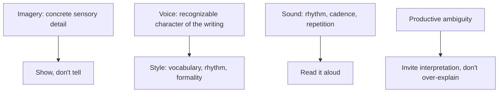

# Creative Writing

> **Purpose:** to create an aesthetic, imaginative, emotional, or interpretive experience.

Creative writing may use any rhetorical mode. Its distinction lies primarily in **artistic intention and execution**: the language is arranged not just to communicate but to *be experienced*.

## When to Use It

- Write fiction, poetry, or drama
- Tell a true story with literary craft (creative nonfiction)
- Build a world, character, or mood
- Make the reader feel something, not just understand something

## Core Characteristics

- Deliberate use of voice and style
- Imagery and figurative language
- Character, setting, conflict, or theme
- Attention to rhythm and sound
- Productive ambiguity — room for the reader to interpret
- Original arrangement of language and experience

## The Craft Levers



| Lever | What it does | Technique |
|---|---|---|
| Imagery | Makes the abstract tangible | Concrete nouns, sensory detail |
| Voice | Makes the writing recognizably *yours* | Vocabulary, sentence rhythm, perspective |
| Sound | Makes prose move | Rhythm, repetition, cadence — read aloud |
| Ambiguity | Invites the reader in | Suggest rather than state; leave productive gaps |

## Key Conventions

### Show, Don't Tell

Reveal through action and detail rather than naming the state: a character who *"grips the table edge until her knuckles whiten"* is more vivid than one who *"felt nervous."*

### Voice Is Chosen, Not Default

Voice emerges from vocabulary, sentence structure, rhythm, perspective, and formality. It should be a deliberate choice, not an accident.

### Attention to Sound

Prose and poetry both move on rhythm. Read the piece aloud to hear where the cadence breaks.

### Productive Ambiguity

Over-explaining flattens the experience. A well-chosen gap lets the reader complete the meaning.

## Example

> The kitchen smelled of burnt sugar and rain. A single bulb swayed over the table, casting the room in slow, swinging light — and for a moment the argument didn't matter.

## Common Pitfalls

- **Telling everything:** no room left for the reader to interpret
- **Voice that isn't there:** writing that could be anyone's
- **Decoration without purpose:** imagery that doesn't serve the experience
- **Neglecting sound:** prose that reads awkwardly aloud

## Quality Criterion

> The language is arranged with artistic intention — imagery, voice, sound, and ambiguity all serve the experience rather than decorate it.

## Template

> Copy this skeleton into a new note; name live files `YYYYMMDD-<slug>.md`. Full fill-in masters: [[short-story]] (fiction), [[media]] (scripts).

```markdown
---
date: YYYY-MM-DD
tags: [writing, creative]
status: draft
---

# <Working title>

**Form:** fiction | poetry | creative nonfiction | drama | script
**Voice / POV:** <who is telling this, and how do they sound>
**The experience I want:** <the one feeling or idea the reader should carry away>

## Sensory anchors
- Sight:
- Sound:
- Touch / texture:

## Sound check
<read this aloud — where does the rhythm break or lift>

## What to leave unsaid
<the productive gap — what the reader completes>
```

## Related

- [[Narrative-Mode]]: fiction's structural engine
- [[Descriptive-Mode]]: imagery and sensory detail
- [[02-Storytelling-Guide]]: structures and scene tools
- [[03-Media-Script-Guide]]: creative writing poured into production formats
- [[00-Writing-Types-Reference]]: the multidimensional model
- [[writing/00_knowledge/advance/tier-2-domains/00_overview|Tier 2 overview]]

## Sources

- Reedsy, "Show, Don't Tell" (https://reedsy.com/blog/show-dont-tell/)
- Slideshare, "Imagery examples in poetry" (https://www.slideshare.net/slideshow/imagery-examples-in-poetry-creative-writing-pptx/276923489)
