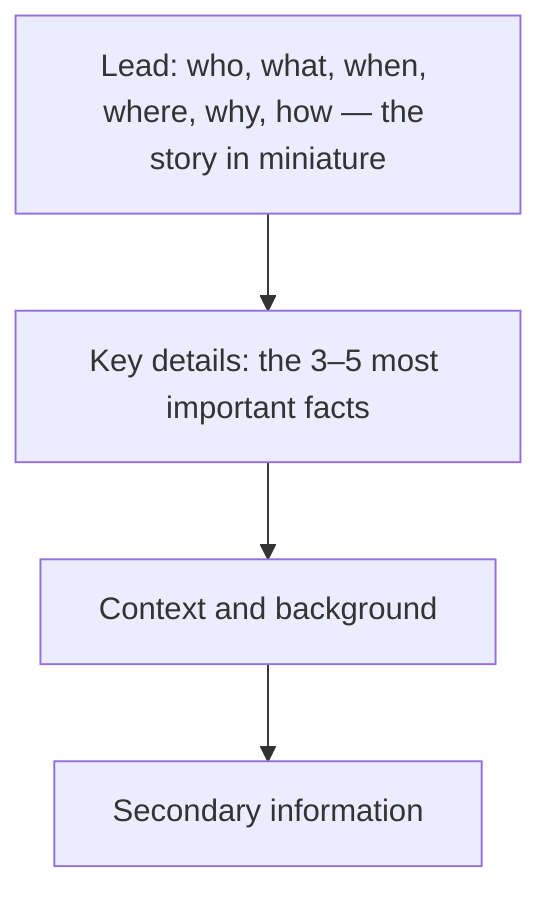

# Journalistic Writing

> **Purpose:** to report and explain matters of public interest.

Journalism's discipline is verification: claims are checked, sources are named, reporting is separated from opinion, and errors are corrected openly.

## When to Use It

- Report news, incidents, or events
- Write features, profiles, or interviews
- Explain a public-interest issue to a general audience
- Publish a review or editorial with clear attribution

## Core Characteristics

- Verification of factual claims
- Clear attribution
- Separation of reporting from opinion
- Timeliness and relevance
- Multiple credible perspectives
- Attention to public consequences
- Corrections when errors are discovered

## Structure: The Inverted Pyramid

News is written most-important-first so it can be cut from the bottom without losing the point:



## Key Conventions

### Attribute Every Claim

Each fact carries its source. Unattributed claims read as the writer's own, which breaks the separation between reporting and opinion.

### AP Style

Most newsrooms follow the Associated Press stylebook: consistent abbreviation, numbers, titles, and capitalization. A style manual is the discipline of consistency and brevity.

### Separate News from Opinion

Reporting states facts; opinion signals judgment. Reviews and editorials are opinion and must be labeled as such, not blended into news.

### Correct Errors Openly

A factual error is fixed with a visible correction. Corrections are a mark of credibility, not embarrassment.

## Example

> The outage began at 09:15 and affected roughly 12,000 users, according to the company's status page. An engineer on the response team, who asked not to be named, said an incompatible database migration was the cause. The service was restored at 11:02.

## Common Pitfalls

- **Unattributed claims:** facts with no visible source
- **Blended opinion:** the writer's judgment smuggled into reporting
- **Burying the lead:** the most important fact placed last
- **No correction path:** errors left standing after discovery

## Quality Criterion

> Every factual claim is verified and attributed, reporting is separated from opinion, and the most important information comes first.

## Template

> Copy this skeleton into a new note; name live files `YYYYMMDD-<slug>.md`. Full fill-in master for the inverted-pyramid form: [[expository]].

```markdown
---
date: YYYY-MM-DD
tags: [writing, journalistic]
---

# <Headline: the conclusion, in one line>

<LEDE: who/what/when/where/why/how in 1–2 sentences — the whole story in miniature>

## Key details
<the 3–5 facts that matter most, most important first>

## Background
<context a reader needs but could skip>

## Sources
<attribution for every claim above>
```

## Related

- [[Expository-Mode]]: the mode that carries news reporting
- [[Narrative-Mode]]: features and profiles use narrative shape
- [[06-Expository-Writing-Guide]]: the inverted pyramid pattern
- [[00-Writing-Types-Reference]]: the multidimensional model
- [[writing/00_knowledge/advance/tier-2-domains/00_overview|Tier 2 overview]]

## Sources

- wikiHow, "How to Write a News Article" (AP style) (https://www.wikihow.com/Write-a-News-Article)
- Prezi, "Grammarian Journal" (inverted pyramid) (https://prezi.com/erhgw2obdohb/grammarian-journal/)
