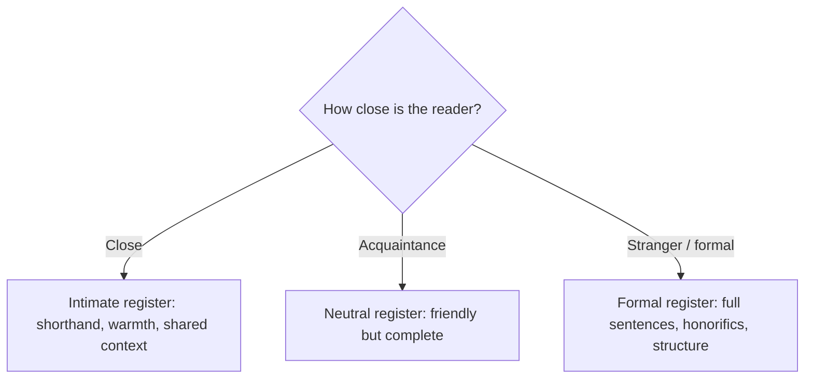

# Personal and Social Writing

> **Purpose:** to express identity, maintain relationships, record experiences, or participate in communities.

Personal writing may be informal, but it still deserves thought about register, audience, privacy, and permanence. The tone is set by the relationship between writer and reader.

## When to Use It

- Write a letter, message, or social post
- Send a wish, greeting, or condolence
- Keep a diary or record of experience
- Share a biographical note or personal statement

## Core Forms

| Form | Register | Permanence risk |
|---|---|---|
| Personal letter | Warm to formal | Low — private |
| Diary / journal | Unfiltered | High — keep it private |
| Social post | Casual | High — public and permanent |
| Message / chat | Immediate | Medium — screenshottable |
| Personal statement | Formal | High — read by strangers |

## The Core Decision: Register by Relationship



The register is not a fixed property of the *writer* but of the *relationship*. The same person writes differently to a close friend than to a supervisor.

## Key Conventions

### Mind the Permanence

A social post or message can be captured and shared beyond its intended audience. Write as if it may outlive the moment.

### Consider Privacy

Personal writing about others involves their privacy too. What is yours to share is not always yours to publish.

### Match the Medium

A birthday wish is one to three lines in chat, a few sentences on a card, and thirty to sixty seconds spoken as a toast. The medium sets the length.

### Preserve the Register When It Matters

In shared or public writing, restore the tone appropriate to the audience — a bare note to yourself is not ready for a team document.

## Example

> Happy birthday, Mint. You shipped the migration *and* kept the team sane during the audit — I still don't know how you did both. This year I hope the portfolio project finally gets the users it deserves. Go celebrate properly. 🎂

## Common Pitfalls

- **Register mismatch:** too casual for the relationship, or too stiff
- **Ignoring permanence:** a message written for one reader that leaks wider
- **Oversharing others' privacy:** publishing what was shared in confidence
- **Wrong length for the medium:** a card that reads like a speech

## Quality Criterion

> The tone matches the relationship, the medium's length is respected, and privacy and permanence are considered before sending.

## Template

> Copy this skeleton into a new note; name live files `YYYYMMDD-<slug>.md`. Full fill-in masters by occasion (birthday, graduation, farewell, condolence): [[wishing]].

```markdown
---
date: YYYY-MM-DD
tags: [writing, personal]
---

# <Note> to <Name>

**Relationship / register:** <close / acquaintance / formal — pick the tone>
**Medium:** <chat / card / social / speech — sets the length>

<Open: greet them, match the register>

<Body: one specific, true thing about their situation>

<Close: scaled to closeness>

---
Permanence check: would this still be fine if it reached a wider audience?
```

## Related

- [[Reflective-Mode]]: diaries and journals are reflection
- [[04-Wishing-Note-Guide]]: register maps and occasion principles
- [[00-Writing-Types-Reference]]: the multidimensional model
- [[writing/00_knowledge/advance/tier-2-domains/00_overview|Tier 2 overview]]

## Sources

- Indeed, "Guide to Tone and Style in Writing" (https://www.indeed.com/career-advice/career-development/tone-and-style-in-writing)
- Referencetone, "Define Your Intended Tone Before Writing" (https://referencetone.com/define-intended-tone-before-writing/)
