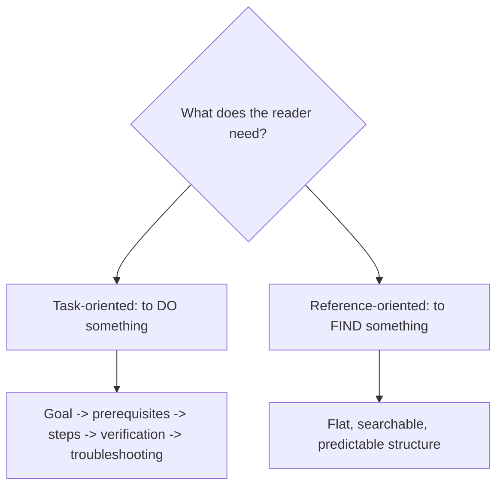
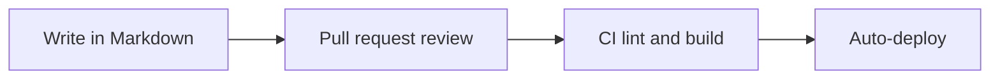

# Technical Writing

> **Purpose:** to communicate specialized information so that readers can understand a system, make a decision, or perform a task.

Technical writing reduces the reader's uncertainty and cognitive load. It is writing that earns its keep by being *usable*: the reader finds the information, understands it, and acts on it.

## When to Use It

- Document an API, system, or architecture
- Write installation, configuration, or runbooks
- Explain a decision, constraint, or failure clearly
- Enable a task without requiring the reader to become an expert

## Core Characteristics

- Accuracy and consistency
- Defined terminology
- Task- or decision-oriented organization
- Explicit assumptions and constraints
- Diagrams, tables, examples, or code where useful
- Attention to safety, accessibility, and maintainability
- Content designed for scanning and retrieval

## Two Organizing Logics



| Logic | Reader's goal | Structure |
|---|---|---|
| Task-oriented | Complete a procedure | Objective → prerequisites → steps → expected result → verification → troubleshooting |
| Reference-oriented | Look up a fact or definition | Searchable, predictable, consistent |

Most good technical docs are a mix: a task *path* for the novice and a reference *index* for the expert.

## Key Conventions

### Docs-as-Code

Modern teams store documentation in the same repository as the code, under the same version control, review, and CI process:



This keeps docs and code in lockstep — a doc that isn't versioned drifts from the truth.

### One Term, One Meaning

Define a term the first time it appears and use it consistently thereafter. Multiple terms for the same concept create false distinctions.

### Lead with the Task, Not the Theory

State the goal first, then the steps, then the explanation. Readers under time pressure need the procedure before the background.

### State Assumptions and Constraints

Make visible what the reader must already have (access, versions, permissions) and what the instructions do *not* cover.

## Example

> To rotate the certificate, run `certbot renew --cert-name homelab`, then reload the service. You need SSH access to `caddy-01` and sudo rights. If the renew fails with "rate limited," wait seven days or use a staging certificate.

## Common Pitfalls

- **Hidden prerequisites:** the reader lacks something the doc never states
- **Mixed terminology:** several names for the same concept
- **Theory before task:** background that blocks the reader from the procedure
- **Docs that drift from code:** unversioned documentation that goes stale

## Quality Criterion

> A qualified reader should find, understand, and act on the information with minimal uncertainty and cognitive load.

## Template

> Copy this skeleton into a new note; name live files `YYYYMMDD-<slug>.md`. Full fill-in master for the technical-doc/runbook form: [[expository]].

```markdown
---
date: YYYY-MM-DD
tags: [writing, technical]
audience:
---

# <Task title>

**Prerequisites:** <access, tools, versions needed before starting>
**Time to complete:** ~X min

## Steps
1. <imperative verb — "Run", "Open", "Set"> `<command/action>`
   Expected output: <what success looks like>
2. ...

## Verification
<how to confirm it worked>

## Troubleshooting
| Symptom | Cause | Fix |
|---|---|---|

## Rollback
<how to undo if something fails>
```

## Related

- [[Instructional-Mode]]: the mode technical writing leans on most
- [[Expository-Mode]]: explanation of systems and concepts
- [[06-Expository-Writing-Guide]]: tech docs, runbooks, and reports
- [[00-Writing-Types-Reference]]: the multidimensional model
- [[writing/00_knowledge/advance/tier-2-domains/00_overview|Tier 2 overview]]

## Sources

- Guidest, "Complete Guide to Markdown Documentation" (docs-as-code) (https://guidest.com/markdown/documentation/)
- Dargslan Publishing, "English for Technical Writing and Documentation" (https://www.dargslanpublishing.com/english-for-technical-writing-and-documentation/)
