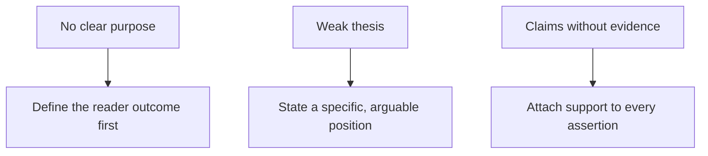

# Common Writing Problems

> **Question it answers:** what is wrong with this piece, and what do I do about it?

Most writing problems trace to a small set of root causes. Diagnosing the *problem* tells you the *fix*.

## The Problem Table

| Problem | Effect | Improvement |
|---|---|---|
| No clear purpose | The text lacks direction | Define the required reader outcome |
| Undefined audience | Detail and tone become inappropriate | Create a reader profile |
| Weak thesis | Readers cannot identify the main claim | State a specific, defensible position |
| Information without structure | Readers cannot form a mental model | Group and sequence related ideas |
| Claims without evidence | Conclusions appear unsupported | Add credible and relevant support |
| Evidence without explanation | Readers must infer its significance | Explain how evidence supports the claim |
| Excessive abstraction | Meaning becomes difficult to visualize | Add concrete examples |
| Unnecessary complexity | Reading requires excessive effort | Simplify syntax and vocabulary |
| Mixed terminology | Readers assume false distinctions | Use one term consistently |
| Hidden assumptions | Reasoning appears incomplete | State relevant assumptions explicitly |
| Repetition | Important points become diluted | Consolidate overlapping sections |
| Premature detail | Readers lose the conceptual overview | Explain the whole before the parts |

## The Most Common Three



If you can fix only three things, fix these. They account for most of what makes writing fail.

## Diagnosing by Symptom

| Reader's complaint | Root cause | Fix |
|---|---|---|
| "I don't know what this is for" | No clear purpose | State the outcome |
| "Who is this for?" | Undefined audience | Reader profile |
| "What's the point?" | Weak thesis | Arguable claim up front |
| "It's all over the place" | No structure | Group and sequence |
| "That's just your opinion" | Claims without evidence | Add support |
| "I don't see why this matters" | Evidence without explanation | Interpret the evidence |
| "It's too dense" | Abstraction / complexity | Concrete examples, simpler syntax |

## Common Pitfalls

- **Fixing symptoms, not causes:** polishing prose when the *purpose* is missing
- **Addressing one problem and ignoring its twins:** weak thesis often rides with claims without evidence
- **Redundant sections kept "for safety":** repetition that dilutes the point

## Quality Criterion

> The piece's problems are correctly diagnosed to their root cause, and each fix addresses that cause rather than its symptom.

## Template

> Copy this skeleton into a new note; name live files `YYYYMM-DD-<slug>.md`.

```markdown
---
date: YYYY-MM-DD
tags: [writing, problems]
---

# <Piece> — Problem audit

| Problem present? | Where it shows | Fix to apply |
|---|---|---|

## Top three to fix first
1. 
2. 
3. 
```

## Related

- [[Writing-Process]]: revision is where problems get caught
- [[Clarity-Principles]]: the fix for abstraction and complexity
- [[Evaluation-Rubric]]: a structured alternative to this checklist
- [[00-Writing-Types-Reference]]: the multidimensional model
- [[writing/00_knowledge/advance/tier-3-craft/00_overview|Tier 3 overview]]

## Sources

- Derived from the master reference section 14; see [[00-Writing-Types-Reference]].
