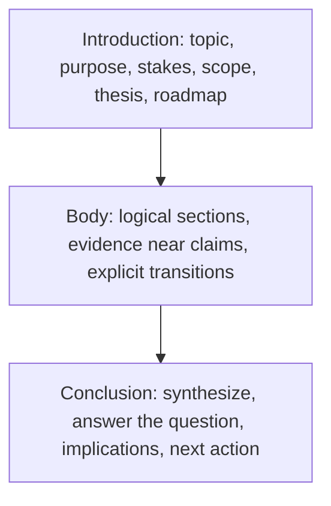

# Document Structure

> **Question it answers:** how do I arrange the whole piece so it holds together?

Most effective nonfiction documents follow a three-part structure. The parts are not just "beginning, middle, end" — each has a distinct job.

## The Three Parts



## Introduction

The introduction should establish:

- The topic
- The purpose
- The audience's reason to care
- The scope
- The controlling question or thesis
- The organization of the document when necessary

## Body

The body should:

- Divide the subject into logical sections
- Place related ideas together
- Present evidence near the relevant claim
- Use headings that communicate meaning
- Make transitions between sections explicit
- Progress from known to unknown or simple to complex

## Conclusion

The conclusion should:

- Synthesize the main findings
- Answer the central question
- State implications
- Identify limitations where relevant
- Define the next action when required

> A conclusion should not merely repeat the introduction. It should show what follows from the material already presented.

## Key Principles

### One Controlling Idea

A document works when a single question or thesis governs it. Sections that don't serve that idea should be cut or moved elsewhere.

### Known to Unknown, Simple to Complex

Order material so each section builds on what came before. A reader who must jump straight into the hard part gets lost.

### Headings That Communicate

A heading like "Results" tells the reader what *category* the section is; "Caching Halves Response Time" tells them what it *says*. Meaningful headings carry the argument.

## Common Pitfalls

- **No controlling thesis:** sections that don't add up to anything
- **Conclusion that repeats the intro:** a restatement instead of a synthesis
- **Premature detail:** the hard specifics arrive before the conceptual overview
- **Weak transitions:** sections stacked without explaining their relationship

## Quality Criterion

> The document moves the reader from purpose to answer along a logical path, with each part doing its distinct job.

## Template

> Copy this skeleton into a new note; name live files `YYYYMMDD-<slug>.md`.

```markdown
---
date: YYYY-MM-DD
tags: [writing, structure]
---

# <Title>

**Controlling question / thesis:** <the one thing this document establishes>
**Audience & their reason to care:** <who, and why they should keep reading>

## Introduction
- Topic:
- Purpose:
- Stakes:
- Scope:
- Thesis / question:
- Roadmap:

## Body — section map
| Section | Job | Evidence it needs |
|---|---|---|

## Conclusion
- Synthesis:
- Answer to the central question:
- Implications:
- Limitations:
- Next action:
```

## Related

- [[Paragraph-Structure]]: the same logic one level down
- [[Writing-Process]]: organizing and outlining the document
- [[00-Writing-Types-Reference]]: the multidimensional model
- [[writing/00_knowledge/advance/tier-3-craft/00_overview|Tier 3 overview]]

## Sources

- UNC Writing Center, "Paragraphs" (https://writingcenter.unc.edu/tips-and-tools/paragraphs/)
- Indiana University WTS, "Paragraphs & Topic Sentences" (https://wts.indiana.edu/writing-guides/paragraphs-and-topic-sentences.html)
