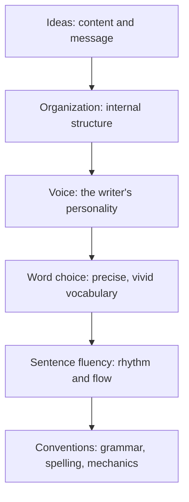

# Evaluation Rubric

> **Question it answers:** how do I judge whether a piece of writing is any good — mine or someone else's?

A rubric makes evaluation explicit and consistent by scoring the same dimensions every time. It turns "I didn't like it" into "here is what it does and doesn't do, on each axis."

## The 15 Dimensions

| Dimension | Evaluation question |
|---|---|
| Purpose | Does the text achieve its intended outcome? |
| Audience | Is it appropriate for the readers' knowledge and needs? |
| Accuracy | Are factual and technical claims correct? |
| Relevance | Does each section contribute to the purpose? |
| Structure | Are ideas organized into a logical progression? |
| Reasoning | Do conclusions follow from evidence and assumptions? |
| Evidence | Are claims supported by credible and sufficient evidence? |
| Clarity | Can readers understand the text without unnecessary effort? |
| Precision | Are terms, quantities, and relationships stated exactly? |
| Coherence | Do sentences, paragraphs, and sections connect meaningfully? |
| Concision | Does the text avoid unnecessary material? |
| Tone | Is the writer's attitude appropriate to the context? |
| Usability | Can readers find and apply the required information? |
| Accessibility | Can people with different needs access the content? |
| Correctness | Are grammar, punctuation, formatting, and references correct? |

## The Six Traits Lens

An alternative, classroom-proven model — the **Six Traits of Writing** — scores a smaller set of qualities:



Use the 15 dimensions for deep diagnosis, the Six Traits for a fast overall read.

## The Scoring Scale

A practical four-point scale:

| Score | Meaning |
|---|---|
| **4 — Excellent** | Fully effective; only minor improvements possible |
| **3 — Competent** | Effective overall but contains identifiable weaknesses |
| **2 — Developing** | Partially effective; substantial revision required |
| **1 — Inadequate** | Does not yet fulfill its primary purpose |

## Key Principles

### Score the Dimension, Not the Feeling

Anchor each score to its evaluation question. "Clarity: 3" means something specific; "it felt okay" does not.

### Distinguish Taste from Defect

Some judgments are objective (accuracy, correctness, evidence); others are taste (voice, tone). Mark which is which rather than scoring both the same way.

### Use It for Revision, Not Just Grading

A rubric's real value is pointing at *what to fix*. A low score on "Evidence" is a to-do item, not a verdict.

## Common Pitfalls

- **Halo effect:** one strong dimension inflating the others
- **Scoring without the question:** a number with no anchor
- **Mixing taste and defect:** judging voice as if it were correctness
- **Rubric as endpoint:** scoring and stopping instead of revising

## Quality Criterion

> The piece is scored on each dimension against its explicit evaluation question, with taste and defect distinguished, and the result points to concrete revision.

## Template

> Copy this skeleton into a new note; name live files `YYYYMM-DD-<slug>.md`.

```markdown
---
date: YYYY-MM-DD
tags: [writing, evaluation]
---

# <Piece> — Evaluation

## Scores (1–4)
| Dimension | Score | Evidence / why | Fix if low |
|---|---|---|---|

## Taste vs defect
- Objective (accuracy, evidence, correctness): 
- Subjective (voice, tone): 

## Top fixes
1. 
2. 
3. 
```

## Related

- [[Common-Writing-Problems]]: a checklist alternative to the rubric
- [[Writing-Process]]: the rubric's scores drive revision
- [[01-Review-Writing-Guide]]: evaluating others' work against criteria
- [[00-Writing-Types-Reference]]: the multidimensional model
- [[writing/00_knowledge/advance/tier-3-craft/00_overview|Tier 3 overview]]

## Sources

- Smekens Education, "The 6 Traits of Writing" (https://www.smekenseducation.com/6-traits-of-writing/)
- Six Traits Brochure (http://mrschristianson.pbworks.com/f/SixTraitsbrochure.pdf)
