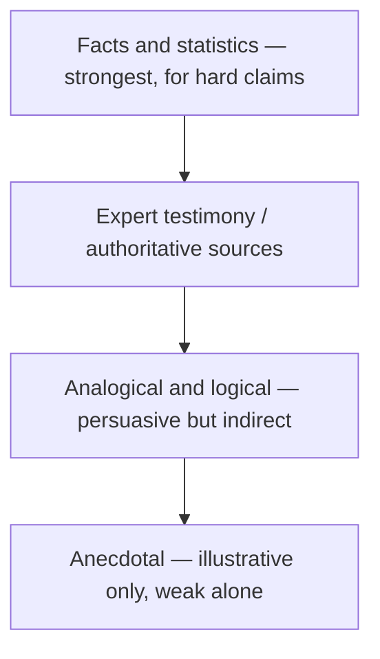

# Evidence and Source Use

> **Question it answers:** what support does this claim need, and is the support actually good?

Different claims require different forms of support. The discipline of evidence is matching the support to the claim, then distinguishing what you *know* from what you *infer*, *assume*, or *opine*.

## Match Support to Claim

| Claim type | Suitable support |
|---|---|
| Factual claim | Verified data, records, or authoritative sources |
| Causal claim | Controlled evidence, mechanism, or comparative analysis |
| Interpretive claim | Textual evidence and a coherent analytical framework |
| Predictive claim | Historical patterns, models, assumptions, and uncertainty |
| Evaluative claim | Explicit criteria and comparative evidence |
| Recommendation | Evidence of benefits, costs, risks, and feasibility |
| Personal reflection | Specific experience connected to analysis |

## The Evidence Ladder

Evidence varies in strength; match the strength to the stakes of the claim:



Anecdote can *illustrate* but rarely *prove*. Use it alongside stronger evidence, not instead of it.

## Good Evidence Is…

- **Relevant** to the claim
- **Sufficient** for the strength of the conclusion
- **Credible** and traceable
- **Representative** rather than selectively chosen
- **Current** enough for the subject
- **Interpreted** rather than merely inserted

## Distinguish the Six Kinds of Statement

The single most important discipline is labeling what kind of statement you're making:

| Kind | Definition |
|---|---|
| **Fact** | A claim supported by verifiable evidence |
| **Inference** | A conclusion derived from evidence |
| **Assumption** | A proposition accepted without direct verification |
| **Opinion** | A judgment or preference |
| **Hypothesis** | A testable proposed explanation |
| **Recommendation** | A proposed course of action |

Mixing these is the most common source of a weak argument — an *assumption* dressed as a *fact*, an *opinion* presented as an *inference*.

## Common Pitfalls

- **Anecdote as proof:** one story treated as sufficient evidence
- **Selective evidence:** choosing only what supports, hiding what doesn't
- **Evidence without interpretation:** a quote or data point dropped in unexplained
- **Assumption passed off as fact:** an unverified premise stated as settled

## Quality Criterion

> Each claim is matched to suitable support, the evidence is credible and interpreted, and fact, inference, assumption, opinion, and recommendation are clearly distinguished.

## Template

> Copy this skeleton into a new note; name live files `YYYYMMDD-<slug>.md`.

```markdown
---
date: YYYY-MM-DD
tags: [writing, evidence]
---

# <The claim being supported>

## Claim
<the assertion, stated precisely>

## Support map
| Evidence | Type (fact / stat / testimony / analogy / anecdote) | What it shows | Source |
|---|---|---|---|

## Statement-kind audit
- [ ] Facts are verifiable
- [ ] Inferences are labeled as such
- [ ] Assumptions are stated explicitly
- [ ] Opinions are marked, not disguised
```

## Related

- [[Argumentative-Mode]]: evidence is the engine of argument
- [[Analytical-Mode]]: separating evidence from interpretation
- [[Paragraph-Structure]]: where evidence sits in a paragraph
- [[00-Writing-Types-Reference]]: the multidimensional model
- [[writing/00_knowledge/advance/tier-3-craft/00_overview|Tier 3 overview]]

## Sources

- Writing Commons, "Types of Evidence" (https://writingcommons.org/section/information-literacy/evidence/types-of-evidence/)
- NROC Developmental English, "Finding and Evaluating Sources" (http://content.nroc.org/DevelopmentalEnglish/unit10/Foundations/finding-and-evaluating-sources.html)
