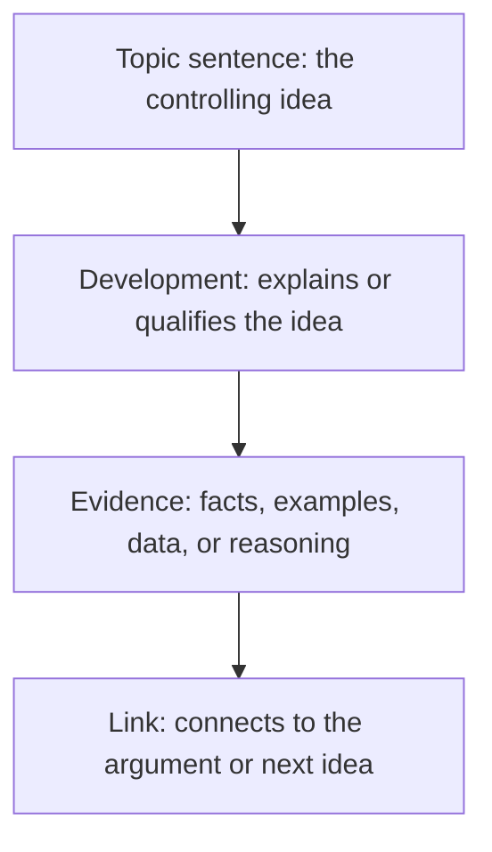

# Paragraph Structure

> **Question it answers:** how do I build a single paragraph that carries one idea?

A functional paragraph usually contains four elements. Multiple frameworks describe the same shape under different labels.

## The Four Elements



## PEEL / TEEL / MEAL — Same Structure, Different Labels

| Element | PEEL | TEEL | MEAL |
|---|---|---|---|
| Controlling idea | Point | Topic sentence | Main idea |
| Support | Evidence | Evidence | Evidence |
| Interpretation | Explanation | Explanation | Analysis |
| Connection | Link | Link | Link |

They are one structure wearing three acronyms. Pick one and apply it consistently.

## The Elements Explained

### Topic Sentence

States the paragraph's controlling idea. A reader should be able to scan the topic sentences alone and reconstruct the argument.

### Development

Explains or qualifies the idea — the writer's own reasoning, not yet the borrowed support.

### Evidence

Facts, examples, data, quotations, or reasoning that support the claim. Placed near the claim it serves.

### Link

Connects the paragraph back to the document's purpose or forward to the next idea.

## Key Principles

### One Idea per Paragraph

A paragraph that makes two points should be two paragraphs. A paragraph longer than half a page usually has more than one idea hiding in it.

### Evidence Needs Explanation

Evidence is not self-interpreting. The writer must explain *why* the evidence matters — what it shows and how it supports the claim.

### A Paragraph Should Not Stand Alone

Each paragraph performs one function in service of the whole. A paragraph that could be deleted without loss is a paragraph that is not pulling weight.

## Common Pitfalls

- **One-sentence paragraphs:** an idea stated but never developed
- **Half-page-plus paragraphs:** several ideas packed into one block
- **Evidence without explanation:** the reader must infer its significance
- **No link:** the paragraph ends without connecting to the next

## Quality Criterion

> A paragraph develops one controlling idea through topic, evidence, explanation, and connection — and a scan of topic sentences reconstructs the argument.

## Template

> Copy this skeleton into a new note; name live files `YYYYMMDD-<slug>.md`.

```markdown
---
date: YYYY-MM-DD
tags: [writing, structure]
---

# <Section / working title>

**Framework:** PEEL | TEEL | MEAL

## Paragraph plan
| # | Topic sentence (controlling idea) | Evidence | Explanation (why it matters) | Link (to what) |
|---|---|---|---|---|
| 1 | | | | |
| 2 | | | | |
```

## Related

- [[Document-Structure]]: the same logic one level up
- [[Evidence-Source-Use]]: choosing and explaining evidence
- [[00-Writing-Types-Reference]]: the multidimensional model
- [[writing/00_knowledge/advance/tier-3-craft/00_overview|Tier 3 overview]]

## Sources

- ResearchProspect, "How to Write a Paragraph (PEEL/TEEL/MEAL)" (https://www.researchprospect.com/how-to-write-a-paragraph-for-essay/)
- Editor World, "TEEL paragraph structure" (https://www.editorworld.com/article/how-many-sentences-in-a-paragraph)
