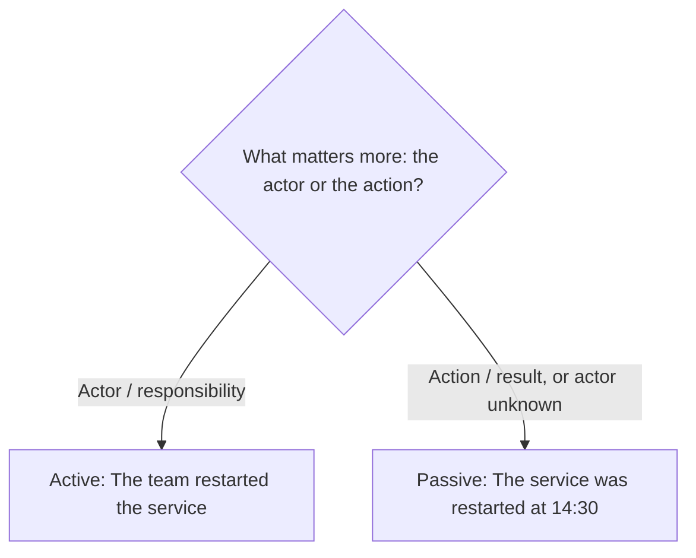

# Tone, Voice, and Style

> **Question it answers:** how do I control *how the writing sounds*, not just what it says?

Tone, voice, and style are related but distinct. They are the "sound" layer of writing, and they should be chosen deliberately rather than produced accidentally.

## The Three Terms

| Term | What it is | Who controls it |
|---|---|---|
| **Tone** | The writer's attitude toward subject and audience | Varies by piece and audience |
| **Voice** | The recognizable character of the writing | Relatively stable — it's *you* |
| **Style** | The mechanics: vocabulary, rhythm, sentence structure, formality | A set of choices |

## Tone

Tone is the attitude the writing carries. Common tones include:

- Formal · Neutral · Analytical · Instructional · Conversational · Reflective · Urgent · Persuasive

Tone is selected per piece: the same writer is formal in a report and conversational in a message. The choice should match the audience and the occasion.

## Voice

Voice emerges from vocabulary, sentence structure, rhythm, perspective, and degree of formality. It is what makes the writing recognizably yours across pieces. Voice is *chosen*, not defaulted into — it comes from consistent choices, not from trying to sound like someone.

## Active vs. Passive Voice

The core choice beneath style:



- Use **active voice** when the actor and responsibility matter.
- Use **passive voice** when the action or result matters more, or the actor is unknown.

Passive voice is not inherently wrong. The test is whether the sentence makes responsibility and meaning sufficiently clear.

## Common Pitfalls

- **Accidental tone:** an attitude that leaks in without intent
- **No voice:** writing that could be anyone's
- **Passive by default:** hiding the actor when responsibility matters
- **Tone mismatched to audience:** too stiff or too casual for the occasion

## Quality Criterion

> Tone matches the audience and occasion, voice is deliberate and consistent, and active/passive choice makes responsibility clear.

## Template

> Copy this skeleton into a new note; name live files `YYYYMM-DD-<slug>.md`.

```markdown
---
date: YYYY-MM-DD
tags: [writing, style]
---

# <Piece title>

**Audience & occasion:** <who reads this, in what situation>
**Intended tone:** formal | neutral | analytical | instructional | conversational | reflective | urgent | persuasive
**Voice notes:** <what should make this recognizably yours — vocabulary, rhythm, formality>

## Style decisions
- Sentence length: <short and direct | varied | long and measured>
- Active vs passive: <default active, passive only when the actor is unknown or irrelevant>
- Vocabulary: <plain | technical | literary>
```

## Related

- [[Clarity-Principles]]: style in service of clarity
- [[Document-Structure]]: where tone and voice show up at the whole-piece level
- [[00-Writing-Types-Reference]]: the multidimensional model
- [[writing/00_knowledge/advance/tier-3-craft/00_overview|Tier 3 overview]]

## Sources

- Indeed, "Guide to Tone and Style in Writing" (https://www.indeed.com/career-advice/career-development/tone-and-style-in-writing)
- Referencetone, "Define Your Intended Tone Before Writing" (https://referencetone.com/define-intended-tone-before-writing/)
