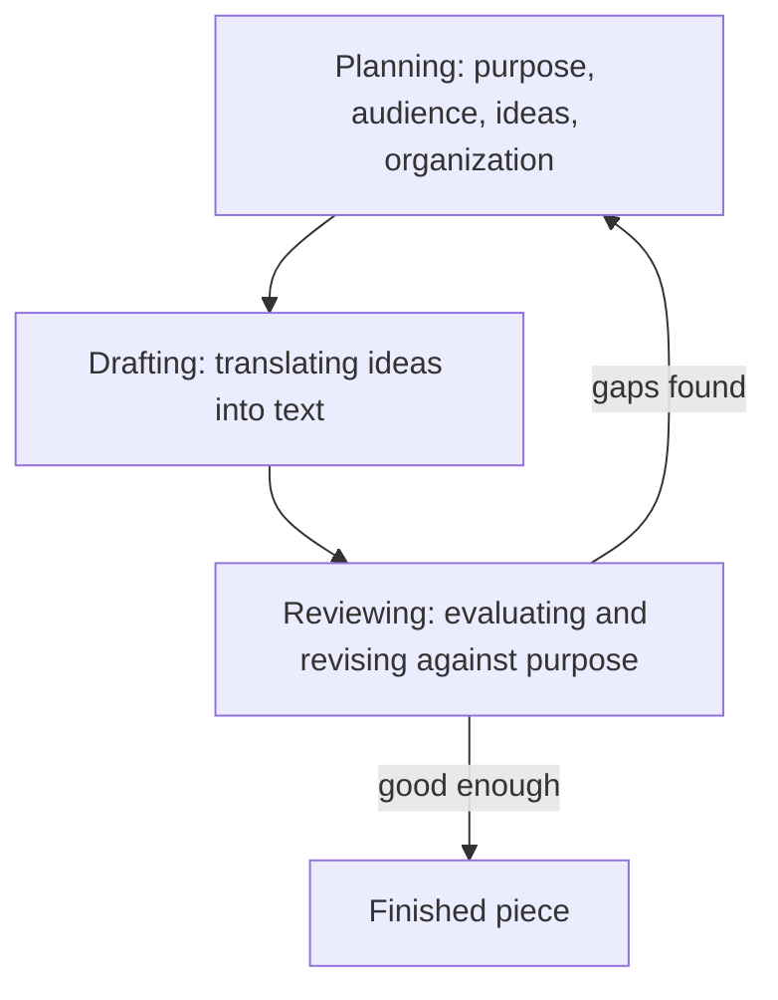

# Writing Process

> **Question it answers:** how do I get from a blank page to a finished piece?

Writing is an iterative process, not a single act. The stages are not a fixed linear path but a loop — you cycle back as understanding deepens.

## The Recursive Model

Hayes and Flower's cognitive model frames writing as three interacting processes — planning, translating (drafting), and reviewing — that recur rather than proceed once in order:



The practical implication: revision is not a cleanup step at the end — it's a constant companion to drafting.

## The Seven Stages (Practical)

### 1. Analyze

- Define the purpose
- Identify the audience
- Clarify the required outcome
- Determine constraints
- Select the genre and primary mode

### 2. Research

- Gather relevant information
- Evaluate source credibility
- Record source details
- Separate evidence from assumptions
- Identify gaps and conflicting information

### 3. Organize

- Formulate the central question or thesis
- Group related ideas
- Select an organizational pattern
- Create an outline
- Determine where evidence belongs

### 4. Draft

- Write for completeness before polishing every sentence
- Keep each section aligned with its purpose
- Use placeholders for unresolved details
- Maintain consistent terminology
- Make assumptions visible

### 5. Revise (meaning and structure)

- Does the text achieve its purpose?
- Is the central claim clear?
- Is the organization logical?
- Is important information missing?
- Are sections redundant?
- Does the evidence support the conclusions?
- Are counterarguments treated fairly?

### 6. Edit (expression)

- Improve sentence clarity
- Remove unnecessary words
- Correct grammar and punctuation
- Standardize terminology
- Check transitions
- Adjust tone and level of detail

### 7. Proofread and Validate

- Check spelling and formatting
- Verify names, dates, figures, and references
- Test instructions where possible
- Check links and cross-references
- Confirm accessibility
- Review the final rendered output

## Key Principles

### Revise for Meaning, Edit for Expression

Revision changes *what you say and how it's organized*; editing changes *how it's phrased*. Doing them in the right order prevents polishing a paragraph that should be cut.

### Draft Fast, Revise Slow

A first draft exists to be revised. Write for completeness, not perfection, then improve.

### Make Assumptions Visible

During drafting, mark the premises you haven't verified. Unresolved assumptions are easier to catch while the text is raw.

## Common Pitfalls

- **Editing before revising:** polishing sentences in a section that doesn't belong
- **One-pass writing:** treating drafting as the whole process
- **Skipping proofread:** typos and broken links that undermine trust
- **Linearity as dogma:** refusing to loop back when a better idea emerges

## Quality Criterion

> The piece has been through analysis, research, organization, drafting, revision, editing, and proofreading — with the writer willing to loop back whenever a gap appears.

## Template

> Copy this skeleton into a new note; name live files `YYYYMM-DD-<slug>.md`.

```markdown
---
date: YYYY-MM-DD
tags: [writing, process]
---

# <Piece title> — Process log

## Analyze
- Purpose:
- Audience:
- Required outcome:
- Constraints:
- Genre / mode:

## Research
- Sources gathered:
- Assumptions to verify:

## Organize
- Thesis / question:
- Outline:

## Draft
- Status: placeholder | partial | complete

## Revise (meaning)
- [ ] Achieves purpose?
- [ ] Central claim clear?
- [ ] Organization logical?
- [ ] Counterarguments handled?

## Edit (expression)
- [ ] Sentences clear and concise?
- [ ] Terminology consistent?

## Proofread
- [ ] Names, dates, links verified?
- [ ] Rendered output reviewed?
```

## Related

- [[Document-Structure]]: the output of organization
- [[Common-Writing-Problems]]: what revision catches
- [[Evaluation-Rubric]]: how to judge the finished piece
- [[00-Writing-Types-Reference]]: the multidimensional model
- [[writing/00_knowledge/advance/tier-3-craft/00_overview|Tier 3 overview]]

## Sources

- ERIC, "Models of Writing (Hayes and Flower)" (https://files.eric.ed.gov/fulltext/EJ1106333.pdf)
- Grokipedia, "Process Theory of Composition" (https://grokipedia.com/page/process_theory_of_composition)
